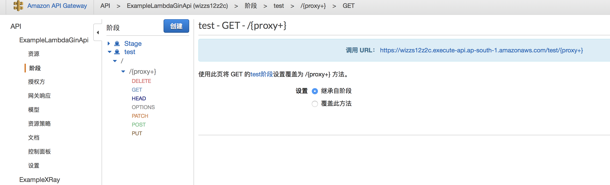
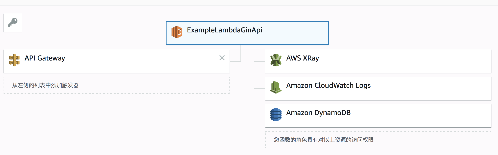

# go-lambda
Lambda go 快速开发库。github地址：[https://github.com/haozzzzzzzz/go-lambda](https://github.com/haozzzzzzzz/go-lambda)，建议使用github地址，可以保证最新的提交。


## 特点

- 快速入门、高效开发、轻量
- api开发完全兼容gin风格的开发
- CloudFormation部署模版自动生成，一键部署应用


## 基础知识

如果是AWS服务的新用户，务必阅读以下连接的文档申请AWS账号以及安装AWS Cli。

- [https://docs.aws.amazon.com/zh_cn/lambda/latest/dg/getting-started.html](https://docs.aws.amazon.com/zh_cn/lambda/latest/dg/getting-started.html)


## 相关AWS基础库

- github.com/aws/aws-lambda-go
- github.com/aws/aws-sdk-go
- github.com/aws/aws-xray-sdk-go
- github.com/awslabs/aws-lambda-go-api-proxy
- github.com/haozzzzzzzz/go-rapid-development

（很多要装的依赖库？使用`gvt fetch github.com/haozzzzzzzz/go-rapid-development` 时gvt会自动帮你安装依赖包的）


## 快速入门

### 安装包

```shell
go get -u github.com/haozzzzzzzz/go-rapid-development
go get -u github.com/haozzzzzzzz/go-lambda
```

推荐大家使用包管理工具进行管理包依赖。我本人使用gvt。

```shel
gvt fetch github.com/haozzzzzzzz/go-rapid-development
gvt fetch github.com/haozzzzzzzz/go-lambda
```


### 构建开发部署工具

**lambda-build**

`lambda-build`工具提供lambda快速开发和编译的工具。位置在本地源码包`github.com/haozzzzzzzz/go-lambda/tool/lambda-build/main.go`

**lambda-deploy**

`lambda-deploy`工具提供lambda部署工具。位置在本地源码包`github.com/haozzzzzzzz/go-lambda/tool/lambda-deploy/main.go`


编译示例

```shell
#!/usr/bin/env bash
export GOROOT=/usr/local/go
export GOPATH=/Users/hao/Documents/Projects/Github/go_lambda_learning

if [ -e lbuild ]
then
    rm lbuild
fi

if [ -e ldeploy ]
then
    rm ldeploy
fi

go build -o lbuild ${GOPATH}/src/github.com/haozzzzzzzz/go-lambda/tool/lambda-build/main.go
go build -o ldeploy ${GOPATH}/src/github.com/haozzzzzzzz/go-lambda/tool/lambda-deploy/main.go
```

此文中，我把lambda-build命名为了lbuid，把lambda-deploy命名为ldeploy，下文也引用这两个别名。


## 示例：构建Lambda HelloWorld函数

示例源码：[https://github.com/haozzzzzzzz/go_lambda_learning/tree/master/src/ExampleLambdaHelloWorld](https://github.com/haozzzzzzzz/go_lambda_learning/tree/master/src/ExampleLambdaHelloWorld)

使用`lbuild add func`函数添加lambda函数，下面是此命令的详细参数：

```
Usage:
  lambda-build add func [flags]

Flags:
  -d, --description string   lambda function description (default "AWS Serverless Function")
  -e, --event string         set lambda function event source type (default "BasicExecutionEvent") Lambda函数的触发事件
  -h, --help                 help for func 此命令的帮助
  -n, --name string          set lambda project name Lambda函数的名字
  -p, --path string          set lambda project path (default "./") Lambda函数项目创建的位置
```

| 长flag        | 短flag | 意义                         | 选项                                         |
| ------------- | ------ | ---------------------------- | -------------------------------------------- |
| --description | -d     | Lambda函数的描述             | 默认描述为“AWS Serverless Function”          |
| --event       | -e     | Lambda函数出发事件           | BasicExecutionEvent（默认）、ApiGatewayEvent |
| --name        | -n     | Lambda函数的名称             | 必填。                                       |
| --path        | -p     | Lambda函数项目创建的文件目录 | 默认为"./"                                   |

示例

```
lbuild add func -n ExampleLambdaHelloWorld -p ./ -e BasicExecutionEvent
```

命令期间会询问创建aws相关的参数，例如region、aws access key等，参数和aws-cli设置在本地的`~/.aws/credentials`参数一致。详细设置参考本文**AWS参数配置**章节。


命令创建了一个名字叫ExampleLambdaHelloWorld的项目，位置在./ExampleLambdaHelloWorld，函数触发的事件是BasicExecutionEvent。此函数拥有Lambda基本执行的权限。

使用项目生成的`deploy.sh`编译部署Lambda程序

```shell
cd ExampleLambdaHelloWorld
./deploy.sh
```

部署完成后，CloudFormation会自动帮你分配所需资源。可以进入aws的lambda控制台创建一个模版为默认模版的test事件，然后执行。会显示以下返回结果。


## AWS参数配置

在`lbuild add func`创建lambda函数的时候需要进行aws环境参数的配置，如果你想修改此配置，可以进入lambda函数项目内，如ExampleLambdaHelloWorld文件夹内，运行`lbuild config`进行重新设置这些参数，这些参数部分与官方的aws cli的configure命令相同，区别在于`lbuid config`的配置对本项目生效，而aws cli是对全局生效。

生成的配置文件存放在`项目目录/.proj/sercret/aws.yaml`下，你也可以手动进行配置。

参数说明：

| 参数名        | 参数意义                                                     | 描述                                       |
| ------------- | ------------------------------------------------------------ | ------------------------------------------ |
| account_id    | aws账户id                                                    | 创建账户时aws分配的id                      |
| access_key    | IAM用户的Access Key ID                                       | 在aws控制台的IAM板块可以创建具体权限的用户 |
| secret_key    | IAM用户的Secret Key                                          |                                            |
| region        | 运行的aws可用区                                              |                                            |
| output_format | 返回格式                                                     |                                            |
| role          | 运行程序的角色，可以指定特定角色，如果为空，则在部署时自动生成运行程序各个依赖服务的权限的角色。 |                                            |


### 示例：使用Lambda构建Gin风格的Api

运行命令一个由ApiGatewayEvent触发的Api项目。

```shell
lbuild add func -n ExampleLambdaGinApi -p ./ -e ApiGatewayEvent
cd ExampleLambdaGinApi
```


目录文件解析：

- .proj目录：工具编译、部署存放配置的目录。
- api目录：存放api实现的目录，其中routers.go是不允许修改的，它由工具自动生成api router的绑定。api的声明和实现可以此怒放在api文件夹下的任意地方，声明有api handler文件需以`api_`为前缀命名文件名。工具默认产生一个`metric/api_metric.go`的接口。
- config目录：系统会自动生成和覆盖当前目录下名字为config的文件夹，所以不能声明自定义的config文件夹，否则将会被覆盖。
- config_dev文件夹：存放开发阶段的配置文件。
- config_test文件夹：存放测试阶段的配置文件。
- config_prod文件夹: 存放正式阶段的配置文件。
- constant文件夹：常量go文件
- handler：存放Lambda函数的地方，在init.go里指定当前有效的Lambda函数处理器。
- deploy.sh：编译发布的脚本。过程会执行以下命令`lbuild compile api`来进行api绑定；`lbuild compile func `来编译打包程序包；`ldeploy remote func`将lambda程序包部署到远程aws云。


直接运行`./deploy.sh`，部署成功后，进入Lambda控制台，可以看到CloudFormation自动生成Lambda函数其相关资源及权限。


####Lambda控制台中测试Lambda API

你可以在Lambda控制台新建以下测试事件，这个事件是基于**API Gateway AWS Proxy**模版创建的。

```json
{
  "body": "{\"test\":\"body\"}",
  "resource": "/{proxy+}",
  "requestContext": {
    "resourceId": "123456",
    "apiId": "1234567890",
    "resourcePath": "/{proxy+}",
    "httpMethod": "POST",
    "requestId": "c6af9ac6-7b61-11e6-9a41-93e8deadbeef",
    "accountId": "123456789012",
    "identity": {
      "apiKey": null,
      "userArn": null,
      "cognitoAuthenticationType": null,
      "caller": null,
      "userAgent": "Custom User Agent String",
      "user": null,
      "cognitoIdentityPoolId": null,
      "cognitoIdentityId": null,
      "cognitoAuthenticationProvider": null,
      "sourceIp": "127.0.0.1",
      "accountId": null
    },
    "stage": "prod"
  },
  "queryStringParameters": {
    "foo": "bar"
  },
  "headers": {
    "Via": "1.1 08f323deadbeefa7af34d5feb414ce27.cloudfront.net (CloudFront)",
    "Accept-Language": "en-US,en;q=0.8",
    "CloudFront-Is-Desktop-Viewer": "true",
    "CloudFront-Is-SmartTV-Viewer": "false",
    "CloudFront-Is-Mobile-Viewer": "false",
    "X-Forwarded-For": "127.0.0.1, 127.0.0.2",
    "CloudFront-Viewer-Country": "US",
    "Accept": "text/html,application/xhtml+xml,application/xml;q=0.9,image/webp,*/*;q=0.8",
    "Upgrade-Insecure-Requests": "1",
    "X-Forwarded-Port": "443",
    "Host": "1234567890.execute-api.us-east-1.amazonaws.com",
    "X-Forwarded-Proto": "https",
    "X-Amz-Cf-Id": "cDehVQoZnx43VYQb9j2-nvCh-9z396Uhbp027Y2JvkCPNLmGJHqlaA==",
    "CloudFront-Is-Tablet-Viewer": "false",
    "Cache-Control": "max-age=0",
    "User-Agent": "Custom User Agent String",
    "CloudFront-Forwarded-Proto": "https",
    "Accept-Encoding": "gzip, deflate, sdch"
  },
  "pathParameters": {
    "proxy": "path/to/resource"
  },
  "httpMethod": "get",
  "stageVariables": {
    "baz": "qux"
  },
  "path": "/metric"
}
```

然后点击测试，会返回以下结果：


#### APIGateway中测试Lambda API

示例源码：[https://github.com/haozzzzzzzz/go_lambda_learning/tree/master/src/ExampleLambdaGinApi](https://github.com/haozzzzzzzz/go_lambda_learning/tree/master/src/ExampleLambdaGinApi)

进入API Gateway控制台，找到与ExampleLambdaGinApi的Api。然后在阶段中找到test阶段的接口声明，查看其测试调用的url。



本文用的是[https://wizzs12z2c.execute-api.ap-south-1.amazonaws.com/test/](https://wizzs12z2c.execute-api.ap-south-1.amazonaws.com/test/)

然后使用HTTP请求工具访问[https://wizzs12z2c.execute-api.ap-south-1.amazonaws.com/test/metric](https://wizzs12z2c.execute-api.ap-south-1.amazonaws.com/test/metric)即可访问到Lambda程序。


#### 创建自动定义的API

接下来我们来创建一个写入和读取DynamoDB数据的示例。

**创建DynamoDB数据表**

进入DynamoDB控制台创建一个简单的user表，主键为uid。


然后在`ExampleLambdaGinApi/api`文件夹中添加`db/api_user.go`，并实现读写两个接口。你可以使用`lbuild add api`的方式进行快速创建此文件，也可以手动创建。不过函数的命名方式**必须准守**以下命名方式：

```go
var <函数名> ginbuilder.HandleFunc = ginbuilder.HandleFunc{
	HttpMethod:   "<HTTP METHOD>",
	RelativePath: "<URI>",
	Handle: func(ctx *ginbuilder.Context) (err error) {
		// ...
		return
	},
}
```

了解更多关于ginbuilder的信息，可以查看[https://github.com/haozzzzzzzz/go-rapid-development](https://github.com/haozzzzzzzz/go-rapid-development)。

api_user.go示例

```go
package db

import (
	dynamodb2 "github.com/haozzzzzzzz/go-lambda/resource/dynamodb"

	"github.com/aws/aws-sdk-go/aws"
	"github.com/aws/aws-sdk-go/service/dynamodb"
	"github.com/aws/aws-sdk-go/service/dynamodb/dynamodbattribute"
	"github.com/haozzzzzzzz/go-rapid-development/web/ginbuilder"
)

type User struct {
	Uid  string `json:"uid"`
	Name string `json:"name"`
}

var AddUser ginbuilder.HandleFunc = ginbuilder.HandleFunc{
	HttpMethod:   "POST",
	RelativePath: "/user/add",
	Handle: func(ctx *ginbuilder.Context) (err error) {
		// 校验post data
		postData := struct {
			Uid  string `json:"uid" yaml:"uid" binding:"required"`
			Name string `json:"name" yaml:"name" binding:"required"`
		}{}
		code, err := ctx.BindPostData(&postData)
		if nil != err {
			ctx.Errorf(code, "bind post data failed. %s", err)
			return
		}

		errorServer := ginbuilder.CodeErrorServer.Clone()
		db, err := dynamodb2.GetDynamodb("ap-south-1") // 这里设置可用区
		if nil != err {
			ctx.Errorf(errorServer, "get dynamodb failed. %s", err)
			return
		}

		userMap, err := dynamodbattribute.MarshalMap(postData)
		if nil != err {
			ctx.Errorf(errorServer, "marshal user data failed. %s", err)
			return
		}

		_, err = db.PutItem(&dynamodb.PutItemInput{
			TableName: aws.String("user"),
			Item:      userMap,
		})
		if nil != err {
			ctx.Errorf(errorServer, "put dynamodb item failed. %s", err)
			return
		}

		// 返回成功
		ctx.Success()

		return
	},
}

var GetUser ginbuilder.HandleFunc = ginbuilder.HandleFunc{
	HttpMethod:   "GET",
	RelativePath: "/user/get",
	Handle: func(ctx *ginbuilder.Context) (err error) {

		// 校验query data
		queryData := struct {
			Uid string `form:"uid" json:"uid" binding:"required"`
		}{}
		code, err := ctx.BindQueryData(&queryData)
		if err != nil {
			ctx.Errorf(code, "bind query data failed. %s", err)
			return
		}

		errServer := ginbuilder.CodeErrorServer.Clone()
		// 从DynamoDB中获取数据
		db, err := dynamodb2.GetDynamodb("ap-south-1") // 这里设置可用区
		if nil != err {
			ctx.Errorf(errServer, "get dynamodb failed. %s", err)
			return
		}

		result, err := db.GetItem(&dynamodb.GetItemInput{
			TableName: aws.String("user"), // 设置表名
			Key: map[string]*dynamodb.AttributeValue{
				"uid": {
					S: aws.String(queryData.Uid), // 设置ID
				},
			},
		})
		if nil != err {
			ctx.Errorf(errServer, "get dynamodb item failed. %s", err)
			return
		}

		person := &User{}
		err = dynamodbattribute.UnmarshalMap(result.Item, person)
		if nil != err {
			ctx.Errorf(errServer, "unmarshal map failed. \n%s.", err)
			return
		}

		// 返回用户
		ctx.SuccessReturn(person)

		return
	},
}
```


然后运行`./deploy.sh`将程序编译部署至aws云，进入Lambda控制台查看dynamodb访问权限已自动加上。




访问`/user/add`接口添加用户。此处用的是POSTMAN


访问`/user/get`	接口获取用户信息。


## 更多示例

- [https://github.com/haozzzzzzzz/go_lambda_learning](https://github.com/haozzzzzzzz/go_lambda_learning)
- (内部工程)[https://xlbj-gitlab.xunlei.cn/oversea/go-lambda-service](https://xlbj-gitlab.xunlei.cn/oversea/go-lambda-service)


## 触发事件

在创建项目时需要选择触发事件的类型，用于创建响应的项目代码。

| 事件参数            | 项目类型                                     |
| ------------------- | -------------------------------------------- |
| BasicExecutionEvent | Lambda基本执行，可接收所有上层AWS Lambda事件 |
| ApiGatewayEvent     | 支持AWS ApiGateway事件触发                   |
|                     |                                              |

